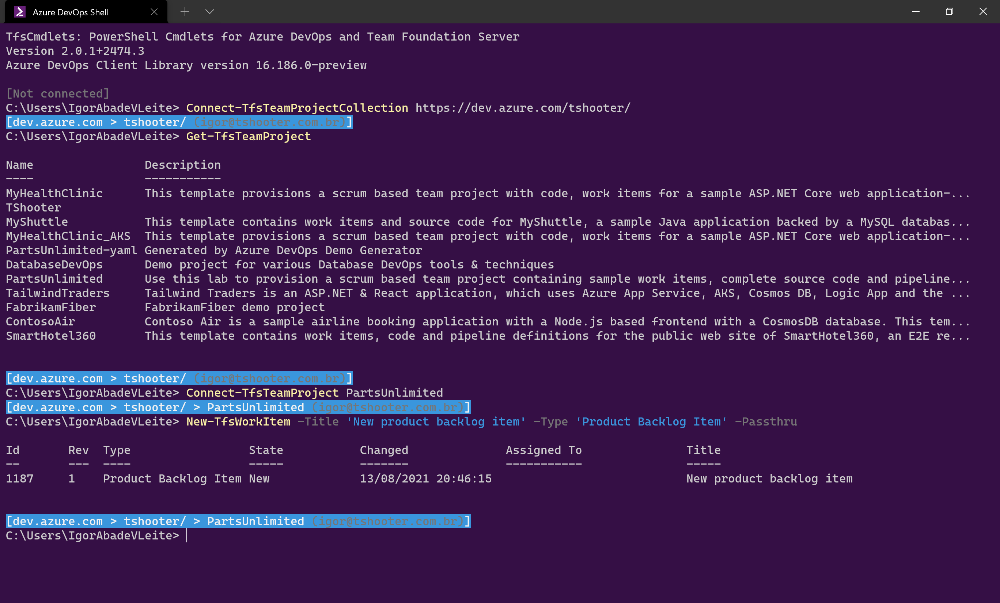

TfsCmdlets
==========

PowerShell Cmdlets for Azure DevOps and Team Foundation Server

## NEW! Version 2.0

[Learn more](Docs/Version2.md)

## Whats is TfsCmdlets?

TfsCmdlets is a PowerShell module which provides many commands ("cmdlets" in PowerShell parlance) to simplify automated interaction with Azure DevOps (Server 2019+ and Services) and Team Foundation Server (up to 2018). 

By using TfsCmdlets, TFS administrators (even power users) can create scripts to automate many different tasks, ranging from retrieving work items to create new team project collections.

TfsCmdlets is available in many formats. The full (MSI-based) installer also includes **Azure DevOps Shell**, a PowerShell window pre-configured to make interacting with TFS via command line a joy!



## Quick start guide 

Firstly, download and configure the latest version of the [Visual Studio ALM Virtual Machine](http://aka.ms/almvm) (a.k.a "_Brian Keller VM_") in your computer in order to have a sandbox to play with. 

Next, install TfsCmdlets inside the virtual machine (see section "_How to install_", below), open a PowerShell window and try the following commands:


```PowerShell
# Connect to the FabrikamFiber team project collection
# (Will be used as default for the -Collection argument when required by a cmdlet)
Connect-TfsTeamProjectCollection http://vsalm:8080/tfs/FabrikamFiberCollection

# Get a list of team projects in the currently connected TPC
Get-TfsTeamProject

# List the existing iterations in the FabrikamFiber team project
Get-TfsIteration -Project FabrikamFiber

# Connect to the FabrikamFiber team project
# (will be used as default for the -Project argument when required by a cmdlet)
Connect-TfsTeamProject FabrikamFiber

# Create a new iteration
New-TfsIteration 'Release 3'

# Get all bugs in the current team project
Get-TfsWorkItem -Filter '[System.WorkItemType] = "Bug"'

# Create a new PBI in the 'Release 3' iteration
New-TfsWorkItem -Title 'New product backlog item' -Type 'Product Backlog Item' -Fields @{'System.IterationPath'='Release 3'}

```

## How to install

TfsCmdlets can be obtained from many different sources and in many different formats. Choose the one most suitable to you!

### PowerShell Gallery

If you're using Windows 10, Windows Server 2016 (or later) or installed Windows Management Framework 5 (or later) then the simplest way to install TfsCmdlets is via [PowerShell Gallery](https://www.powershellgallery.com/).

Open an elevated PowerShell prompt and type:

```PowerShell
Install-Module TfsCmdlets
```

Optionally, you can install it locally in your user profile. That is particularly useful when you can't run as an administrator or don't want to make the module available to all users in the computer:

```PowerShell
Install-Module TfsCmdlets -Scope CurrentUser
```

[Additional information](https://www.powershellgallery.com/packages/TfsCmdlets/)

### Chocolatey

Using Chocolatey? Then open an elevated PowerShell prompt and type:

```PowerShell
# To install the latest pre-release (alpha, beta) version of TfsCmdlets, type:
choco install TfsCmdlets -pre

# To install the latest final release version of TfsCmdlets, type:
choco install TfsCmdlets
```

### Nuget

Nuget is a great option if you need to integrate TfsCmdlets with your continuous integration process (e.g. you need to create a TFS work item during the execution of an automated build).

To add TfsCmdlets to your solution, search for **TfsCmdlets** in the Visual Studio "_Manage Nuget packages for solution..._" dialog.

- Note: To add the latest pre-release version of TfsCmdlets, don't forget check the "Include prerelease" checkbox

[Additional information](http://www.nuget.org/packages/tfscmdlets)

### Offline installation

When the target machine is not connected to the internet, none of the options above are available. In that case, your best bet is one of the offline installation alternatives below.

You can get one of the offline installers listed below from the [GitHub Releases](https://github.com/igoravl/tfscmdlets/releases) page.

#### Full installer (MSI-based)

The full installer will install the module files to the Program Files folder in your computer, make the module available to PowerShell and create the **Azure DevOps Shell** icon in the Start Menu.

**To install the full installer**:

- Download the MSI file from the [Releases](https://github.com/igoravl/tfscmdlets/releases) page;
- Open the downloaded MSI file
	- **NOTE**: If Windows SmartScreen flags the file as insecure and refuses to run it, you can click the "More info" button/link in the dialog and select the "Run anyway" option.

**To uninstall the full installer**:

- Use the _Programs and Features_ (formerly "Add and remove programs") function in the Windows Control Panel.

#### Portable installer

The portable installer is a zip file containing all the required the module files. 

**To install the portable installer**:

- Download the zip file from the [Releases](https://github.com/igoravl/tfscmdlets/releases) page;
- Open your Documents folder in Windows, then open the ```WindowsPowerShell``` folder in it;
- Inside the WindowsPowerShell folder, create a new folder called ```Modules``` in it (if missing) and then create a new folder called ```TfsCmdlets``` in ```Modules```;
- Extract the contents of the zip file to the ```TfsCmdlets``` folder.

You must end up with a folder structure similar to ```[Documents]\WindowsPowerShell\Modules\TfsCmdlets```. Files such as ```TfsCmdlets.psd1``` must be located in the TfsCmdlets folder.

To test the installation, open a new PowerShell window and type:

```PowerShell
Import-Module TfsCmdlets
```

**To uninstall the portable installer**

- Close all PowerShell windows where you were using TfsCmdlets (to free files in use);
- Delete the ```TfsCmdlets``` folder from the ```[Documents]\WindowsPowerShell\Modules``` folder.

## Contribution Guidelines

Coming soon.

## Additional Information

- [Release Notes](https://github.com/igoravl/tfscmdlets/wiki/RELEASENOTES)
- [Online Documentation](https://github.com/igoravl/tfscmdlets/wiki/docindex)

[](https://dev.azure.com/TfsCmdlets/TfsCmdlets/_build/latest?definitionId=2&branchName=master) [](https://github.com/igoravl/tfscmdlets/issues) [](https://github.com/igoravl/tfscmdlets/forks) [](https://github.com/igoravl/tfscmdlets/stargazers) [](https://raw.githubusercontent.com/igoravl/tfscmdlets/master/LICENSE.md) [](http://nuget.org/packages/tfscmdlets) [](http://chocolatey.org/packages/tfscmdlets) [](https://github.com/igoravl/tfscmdlets/releases) [](https://twitter.com/intent/tweet?text=TfsCmdlets%3A%20PowerShell%20Cmdlets%20for%20TFS%20and%20VSO&url=https%3A%2F%2Fgithub.com%2Figoravl%2Ftfscmdlets)
